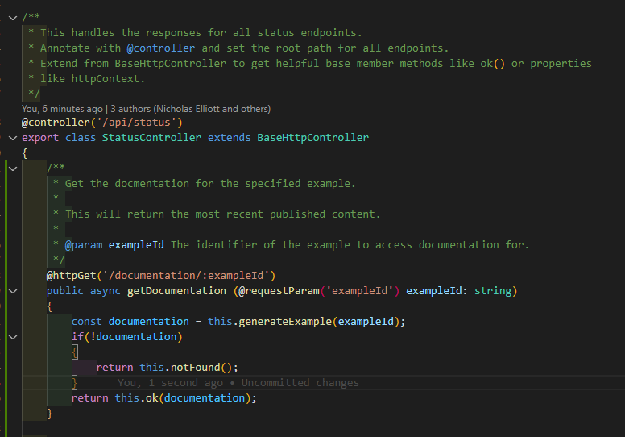
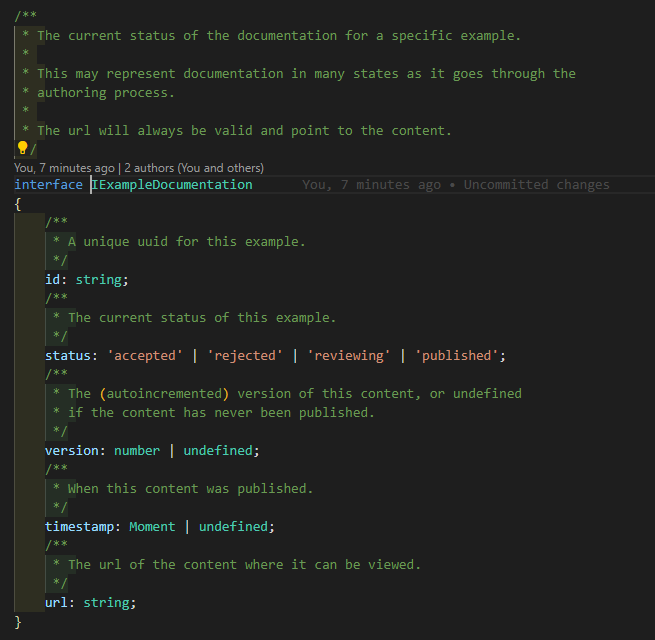

# ts-openapi-gen

A generator for [OpenApi documentation](https://www.openapis.org/) based on Typescript, Express, Inversify and TypeDoc.

## Overview

Code an API using [Express](http://expressjs.com/) and [inversifyJS](https://inversify.io/). Comment it using [JSDoc](https://jsdoc.app/about-getting-started.html)...

... and type it using [Typescript](https://www.typescriptlang.org/) (NOTE: due to typedoc limitations, only supports 4.0 -> 4.7).

Install typedoc and ts-openapi-gen

`yarn add --dev typedoc@~0.22 typedoc-plugin-expand-object-like-types@^0.1 typedoc-plugin-missing-exports@^2.1 ts-openapi-gen`

Now generate your [OpenApi](https://www.openapis.org/) schema directly from your code -- types and comments extracted, inferred, and included!

`yarn run typedoc --json ./docs/typedoc.json --entryPointStrategy Expand --disableSources --plugin typedoc-plugin-expand-object-like-types --plugin typedoc-plugin-missing-exports --pretty src/controllers`
`yarn run ts-openapi-gen --entrypoint ./docs/typedoc.json --out assets/public/openapi.json`

## Getting Started

This presumes you have a RESTful web-api you are building, utilizing Typescript for typing,
JSDoc for commenting, and inversify-express-utils to scaffold your API endpoints on top of express.

#### Requirements:

* InversifyJS & inversify-express-utils
* Typescript 4.7
* Express

Your project must be in buildable state (node_modules installed, code builds, etc).  Point ts-openapi-gen to your root tsconfig file and the location of the entrypoints (the controllers).

#### Generating the OpenApi Schema

ts-openapi-gen has three parameters:

|Parameter|Description|Required|
|--|-|-|
| --typedoc | The generated typedoc json file. | :heavy_check_mark: |
| --tsconfig | Points to the tsconfig for your project; required to be able to interpret the types included and referenced; defaults to tsconfig.json in the current directory. |  |
| --out | The name of the file to write the schema to; defaults to `openapi.json` if not provided. | |

## Features

* Automatically discover published endpoints
* Inspect annotations and derive:
  * Http Method
  * Paths
* Inspect JSDoc comments and derive:
  * Short and long comments
  * Descriptions of parameters and return values
* Reflect Typescript types and derive:
  * Schemas for POST bodies
  * Schemas for API response data
  * Automatically unwrap inversify types (Promise, OkNegotiatedContent, etc)

## How to write a web api that can be seamlessly auto-documented

Check out our [samples](samples/getting_started) for example projects that can be documented.  

## How to Contribute

Check out our [Contribution Guide](Contributing.md)!  Some examples of what you can do:

* Start a discussion on a desired feature, then implement it if you can!
* Submit a PR for a bugfix.
* Open an issue for a problem you found.
* Write some documentation.

## Authors

[Skyward App Company, LLC](https://skywardapps.com)

## Technologies

     

     